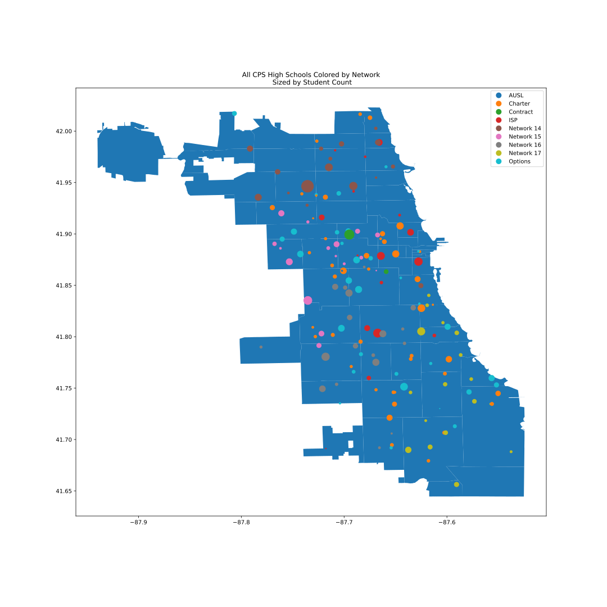

# Table of Contents  
[Summary](#Summary)  
[Data Sources](#Data Sources)  
[Modeling](#Modeling)  

# Summary

> This projects models Chicago Public Schools high school graduation rates with regression techniques.  I am aware that graduation rates are not the be all end all as a metric for school quality. Like test scores, graduation rates are just numbers. No matter how hard one tries, numbers can never capture the full picture of a student's education. Nonetheless, a linear regression study requires a continuous target variable, and graduation rate fits the bill.

---

# Data Sources

The school year profile `csvs` have been downloaded from the [Chicago Data Portal](https://data.cityofchicago.org/).   

The first source of data are the school year profiles:

  - [2016-2017 Profile](https://data.cityofchicago.org/Education/Chicago-Public-Schools-School-Profile-Information-/8i6r-et8s)
  - [2017-2018 Profile](https://data.cityofchicago.org/Education/Chicago-Public-Schools-School-Profile-Information-/w4qj-h7bg)
  - [2018-2019 Profile](https://data.cityofchicago.org/Education/Chicago-Public-Schools-School-Profile-Information-/kh4r-387c)

Files should be downloaded and placed in the `data/chicago_data_portal_csv_files` folder.

I supplimented the Data Portal data with mean incomes associated with each school's zipcode.  I used Selenium to scrape income data from the [census]( https://factfinder.census.gov). The code for the scrape can be found in the Jupyter notebook found in the [data](./data) folder.

--
# Feature Engineering

> Both the 2016-17 and 2017-18 original datasets from the data portal dataset includes 661 total schools and 184 high schools.  Of those 184 high schools, 121 in  2016-17 and 124 in 2017-18 had non-null graduation rates.  A histogram of the graduation rates across both years is left-skewed:

> Skew for 2016/17 school year: -1.9389214792620162  
> Skew for 2017/18 school year: -1.94880818014248

> In order to perform a valid linear regression, the target distribution must be approximately Gaussian.  To make it so, I reflected, then log-transformed the data. After doing so, the skew is significantly lower:

> Skew for 2016/17 after log-transformation: -0.5025009349240924  
> Skew for 2017/18 after log-transformation: -0.5371894528156189  

> The features are not consistent across years; for 2016-17 there are 91 feature columns, and for 2017-18 there are 92. The following is a list of the features I analyzed.  

 > 1. Administrator
 > 2. Grades_Offered_All
 > 3. Student_Count_Total
 > 4. Student_Count_Low_Income
 > 5. Student_Count_Special_Ed
 > 6. Student_Count_English_Learners
 > 7. Student_Count_Black
 > 8. Student_Count_Hispanic
 > 9. Student_Count_White
 > 10. Student_Count_Native_American
 > 11. Student_Count_Other_Ethnicity
 > 12. Student_Count_Asian_Pacific_Islander
 > 13. Student_Count_Multi
 > 14. Student_Count_Hawaiian_Pacific_Islander
 > 15. Student_Count_Ethnicity_Not_Available
 > 16. Dress_Code
 > 17. Classroom_Languages
 > 18. Transportation_El

> Look in the feature_engineering/feature_engineering.py file for the code for the feature tranformations. For exploratory analyses, look at the eda.ipynb or eda.html file.

